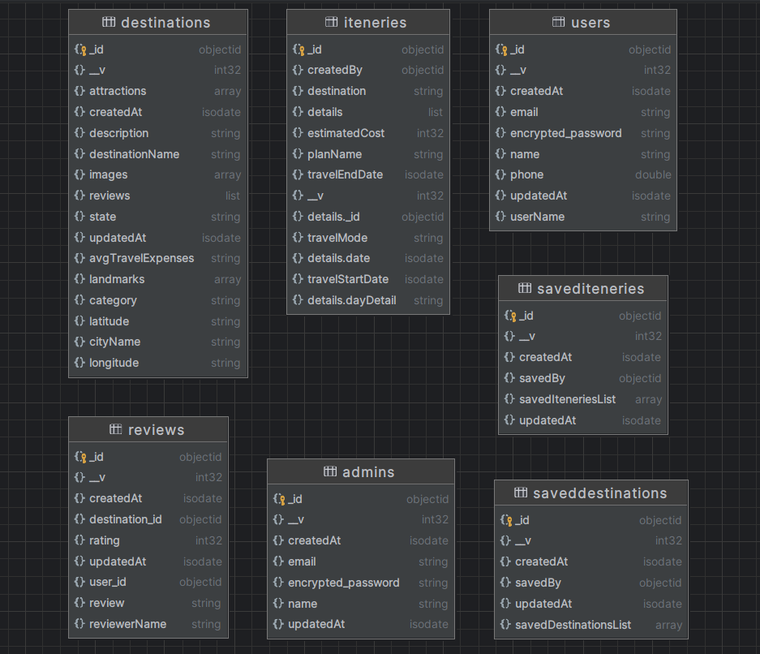

# Venue Planner Pro - Backend

API BASE_URL - https://goldfish-app-ucpgy.ondigitalocean.app/test

Documentation Link - 
## Tech Stack

    

## Collection Schema Reference



## Features

- User Authentication using JWT Token.
- Password Hashing using Bcrypt.
- Intelligent Search, where users can search for destinations and venues using keywords.
- Admin APIs for listing destinations (Role based Authentication).
- Customizable Itenery Planner, which users can share.
- Interactive Venue Planner, users can navigate through the venue and check out the details, using Google Maps.
- Users can add their ratings and reviews for the destinations and venues.
- Secure API using Helmet.
- JWT Token Authentication.

## Endpoints
### User Endpoints
* ```POST /api/v1/signup``` - User Signup

* ```POST /api/v1/signin``` - User Login

* ```POST /api/v1/get-destination``` - Search for destinations and venues using destination_id and also weather and review detail.

* ```GET /api/v1/get-all-destinations``` - Get all in an array of destinations.

* ```POST /api/v1/add-review``` - Add a review for a destination or a venue.

* ```POST /api/v1/add-itenery``` - Create a new itenery.

* ```POST /api/v1/see-itenery``` (Open endpoint) - See a particular itenery.

* ```GET /api/v1/created-itenery-list``` - User can see all the iteneries created by him/her.

* ```POST /api/v1/save-destination-toggle``` - Save a destination to your profile. It provides a toggle functionality.

* ```GET /api/v1/get-saved-destinations``` - Get all the saved destinations.

* ```POST /api/v1/save-itenary-toggle``` - Save an itenary to your profile. It provides a toggle functionality.

* ```GET /api/v1/get-saved-itenaries``` - Get all the saved itenaries.

* ```GET /api/v1/get-all-keywords``` - Get all the keywords for search.

* ```POST /api/v1/search-destination``` - Search for destinations and venues using keywords (Intelligent Search).

## Admin Endpoints

* ```/api/v1/admin/signin``` - Admin Login.

* ```/api/v1/admin/signup``` - Admin Signup.

* ```/api/v1/admin/add-destination``` - Add a new destination to the portal.


## Installation

Install Venue-Planner-Pro with npm

```bash
  git clone - git@github.com:itsadityap/Travel-Planner-Pro.git
  cd Venue-Planner-Pro/
  npm install
  node server.js
```

## Environment Variables

To run this project, you will need to add the following environment variables to your .env file
```bash
  MONGO_DB_URL
  SECRET
  WEATHER_API_KEY
  WEATHER_API_HOST
```
